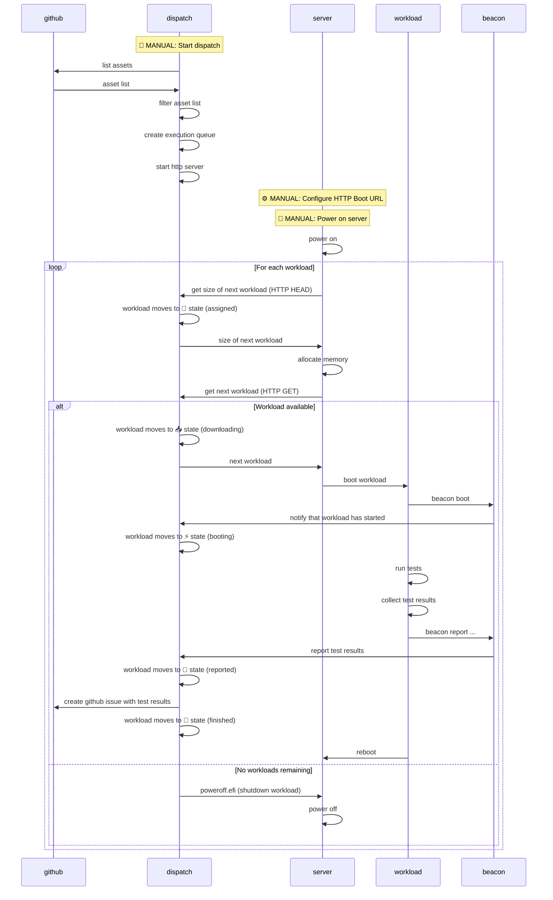

[](https://github.com/AMDEPYC/dispatch/actions/workflows/ci.yml)
[](https://opensource.org/licenses/MIT)
[](https://forge.rust-lang.org/infra/channel-releases.html)

# dispatch

**Automated EFI workload orchestration**

`dispatch` automates bare-metal testing workflows. It does the following:

1. downloads metadata of dispatch-enabled workloads from GitHub release assets
2. manages the queue of workloads and workload execution state
3. offers workload download over HTTP for HTTP boot clients
4. files GitHub issues with workload execution results

For full details, see below.

## Quick Start

```bash
# Authenticate with GitHub
gh auth login

# Serve all dispatch-enabled assets from latest release
dispatch --owner AMDEPYC --repo dispatch --tag example

# Filter which dispatch-enabled assets to run by name
dispatch --owner AMDEPYC --repo dispatch --tag example workload-7
```

See [Permissions](#permissions) section  for more on authenticating with GitHub.

## How It Works



## Core Features

- **GitHub Integration**: Automatically loads assets from GitHub releases
- **HTTP Boot Server**: Standards-compliant HTTP boot for bare metal
- **Job Queue Management**: Tracks workload assignment and execution state
- **Automated Reporting**: Creates GitHub issues from workload results
- **Service Discovery**: mDNS broadcast for network discoverability
- **Opt-in Deployment**: Only assets with dispatch content types are deployed

## Asset Filtering and Content Types

`dispatch` uses an **opt-in** deployment model through custom content types.
Only assets explicitly tagged with dispatch-specific content types will be
deployed, allowing repositories to control which workloads participate in
automated testing.

### Dispatch Content Types

The following content types are recognized by dispatch:

| Dispatch Content-Type          | Translated to...          | Description              |
|--------------------------------|---------------------------|--------------------------|
| `application/vnd.dispatch+efi` | `application/efi`         | EFI modules/applications |
| `application/vnd.dispatch+iso` | `application/vnd.efi-iso` | ISO disk images          |
| `application/vnd.dispatch+img` | `application/vnd.efi-img` | Ramdisk images           |

### Example

| Asset Name | Asset Content-Type             | Dispatched as...          |
|------------|--------------------------------|---------------------------|
| `foo.iso`  | `application/vnd.dispatch+iso` | `application/vnd.efi-iso` |
| `qux.iso`  | `application/vnd.efi-iso`      | **ignored**               |
| `bar.efi`  | `application/vnd.dispatch+efi` | `application/efi`         |
| `baz.efi`  | `application/octet-stream`     | **ignored**               |

Only files with the `application/vnd.dispatch+*` content types will be included in the dispatch queue.

## Workflow States

Each workload progresses through these states:

1. **⏳ Unassigned** → Available for assignment
2. **📌 Assigned** → Reserved for specific server IP
3. **📥 Downloading** → Server fetching workload
4. **⚡ Booting** → Workload is booting (via `beacon boot`)
5. **📝 Reported** → Results submitted (via `beacon report`)
6. **🏁 Finished/Failed** → Final state

## Permissions

dispatch uses GitHub APIs to download Release Assets and to create Issues in the repo specified on the dispatch command line. Certain permissions are needed for this to work.

### Option 1

Before running dispatch, run 'gh auth login' and choose to authenticate via the web browser flow.

### Option 2

Before running dispatch, run 'gh auth login' and choose to authenticate by pasting an authentication token. 

#### Fine-grained PAT
  
If using a fine-grained token (PAT), it must have, at a minimum, the following permissions:
    
- `Contents` Read-only access
- `Issues` Read and write access
  
#### Classic PAT
  
If using a classic token (PAT), it must have, at a minimum, the `repo` permission.

### Option 3

When running dispatch, use the --token option and specify either a fine-grained or a classic PAT as described above.

### Option 4

Before running dispatch, set an environment variable named GITHUB_TOKEN to either a fine-grained or a classic PAT as described above.
